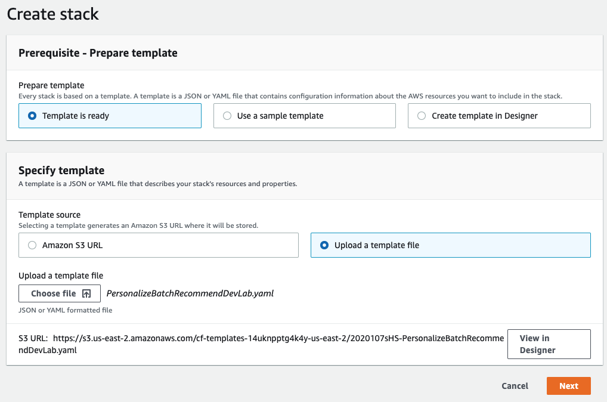
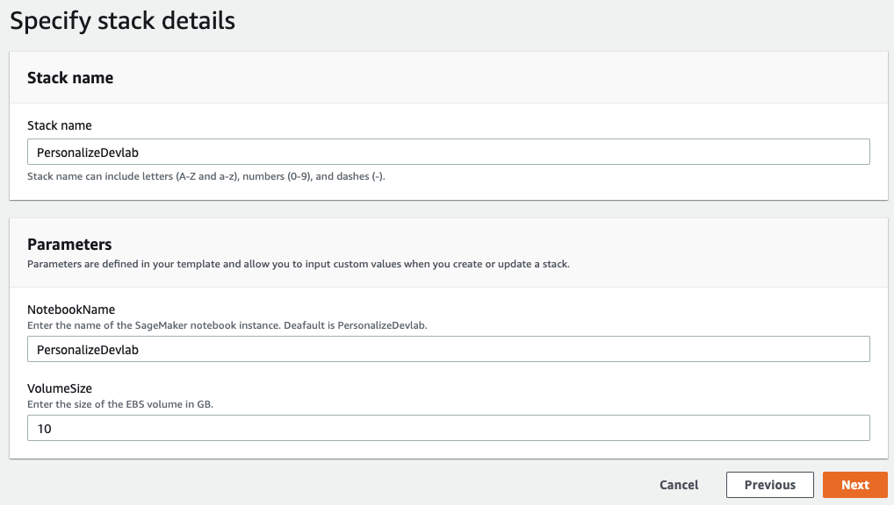
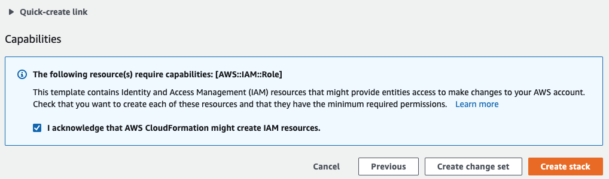

# personalize-batch-recommendations
Generate batch personalized recommendations using Amazon Personalize

## Introduction
---
This lab will show you how to setup an end-to-end Personalize batch recommendation.

1. Prepare and import data
2. Create a solution
3. Generate batch recommendation

**Setup**

## Deploying Your Working Environment

The first step is to deploy a CloudFormation template that will perform much of the initial setup work for you. 

1. Download the cloudformation template

Go to the following URL https://raw.githubusercontent.com/dalacan/personalize-batch-recommendations/master/PersonalizeBatchRecommendDevLab.yaml, right click 'Save As' and download the cloudformation template.

**Note** Make sure you save the file as a .yaml file.

2. Create a new cloud formationstack

In another browser window or tab, login to your AWS account. Once you have done that, open the link below in a new tab to start the process of deploying the items you need via CloudFormation.

3. Upload the cloud formation template

Select `Upload a template`,  click `Choose file` and select the cloudformation template file you've just downloaded and then click `Next`.

4. Specify stack details

In this section, **optionally** specify the following options:
    
        1. Stack name - Change the stack name to something more relevant if required.
        2. Notebook name - Change the name of your SageMaker notebook which you will be using if required.
        3. VolumenSize - Set the size of SageMaker EBS volume (default is 10GB). If you expect to load a larger dataset (i.e. if you want to reuse this lab to experiment with larger dataset), increase this accordingly.

When you're done, click the `Next` button at the bottom of the page

5. Configure stack options

All of the defaults in this section will be sufficient to complete the lab. If you have any custom requirements, please alter as required. Once you're done, click the `Next` button to continue.

Finally, in the next section, scroll to the bottom of the page and check the checkbox to enable the template to create IAM resources and click the `Create stack` button.

It will take a few minutes to provision the resources required for the lab. Once it is completed, navigate to the `SageMaker` service by clicking `Services` in tht top of the console and then search for `SageMaker` and click on the service.

6. Launch the SageMaker notebook

## Cleanup
Once you're done with the lab, please make sure you follow the instructions at the end of the notebook to delete all the resources you created in your AWS account.

---

## References
- [Personalize Product Page](https://aws.amazon.com/personalize/)
- [Personalize Documentation](https://docs.aws.amazon.com/personalize/latest/dg/what-is-personalize.html)
